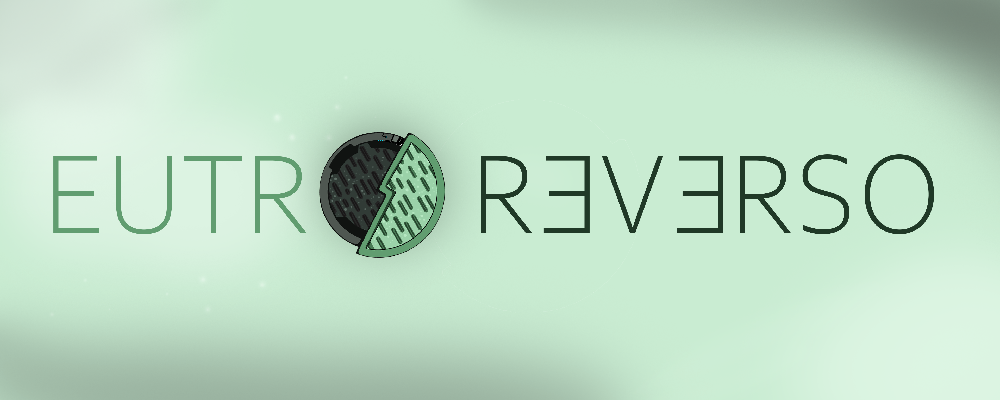

# **Eutro-Reverso**

Eutrophication is the process by which an entire body of water, or parts of it, becomes progressively enriched with minerals and nutrients. This can be a problem in marine habitats such as lakes as it can cause algal blooms. Some algae even produce toxins that are harmful to higher forms of life. This can cause problems along the food chain and affect any animal that feeds on them.

We, members of Eutro-Reverso aim to start reversing this process, starting locally with lakes and shallow water bodies. Our solution comes in two phases - 

# Phase 1: Identification of affected areas 

In this phase we plan to use data collected the MODIS and Landsat-8 datasets (provided by the USGS) to test out an algorithm designed to identify the presence of chlorophyll-a and phytoplankton. 

Chlorophyll-a presence can be detected through the characteristic colour that it gives the water. 

We will be running a cross-check across images in the visible spectrum and images in the infrared spectrum to account for the change in temperature that occurs alongside eutrophication. 

**This repository will be used for the development of Phase 1. By the end of this phase, we wil be able to identify the degree of concentration of chlorophyll-a in water using multipsectral remote-sensing data.** 

Resources:

[OpenCV](https://opencv.org/)

[EarthExplorer](https://earthexplorer.usgs.gov/)

[MODIS dataset](https://modis.gsfc.nasa.gov/data/)

[Landsat 8 dataset](https://www.usgs.gov/landsat-missions/landsat-data-access#C2L2)

